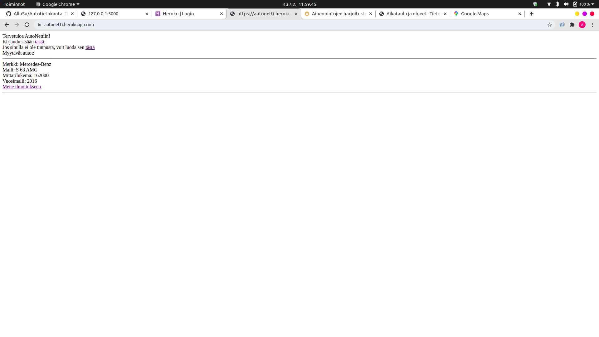
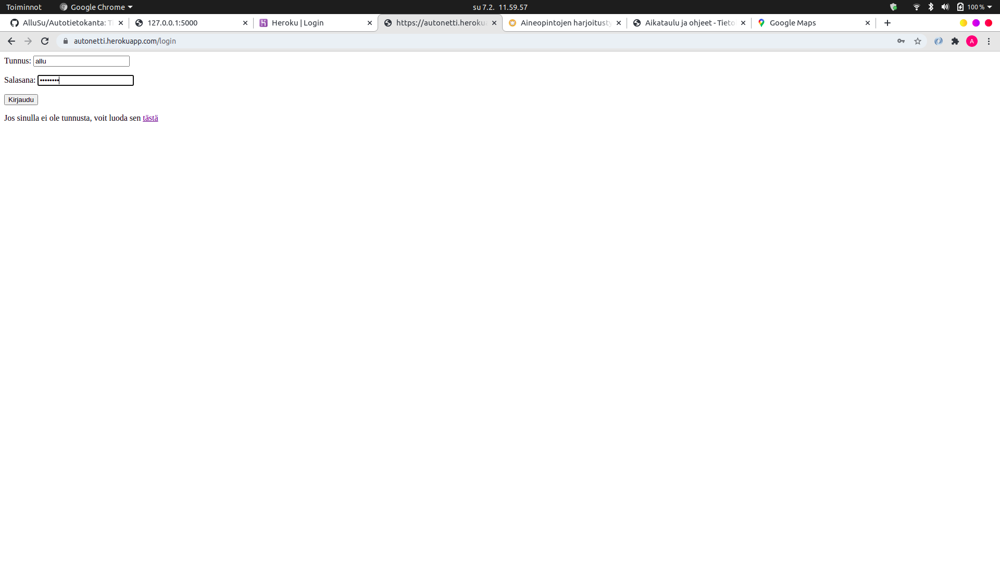
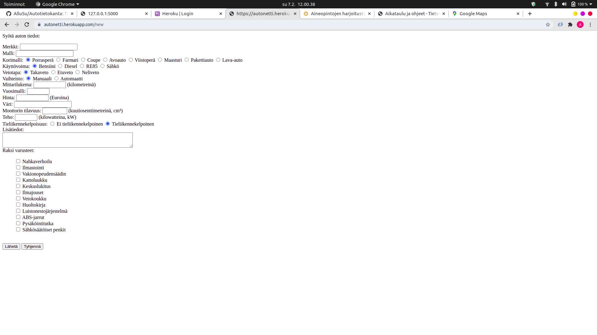
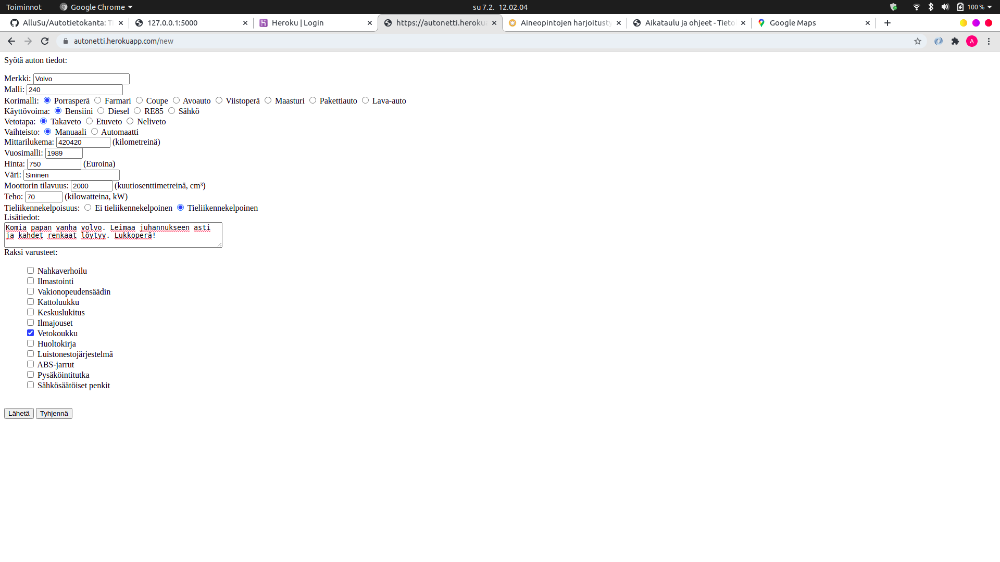
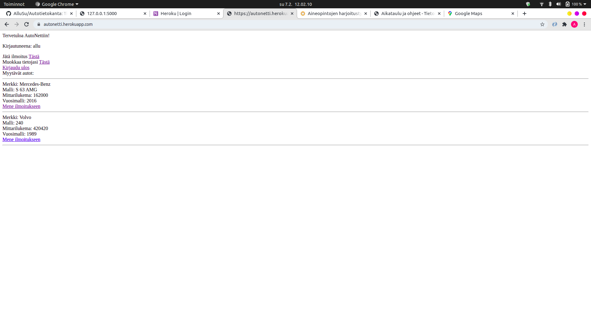
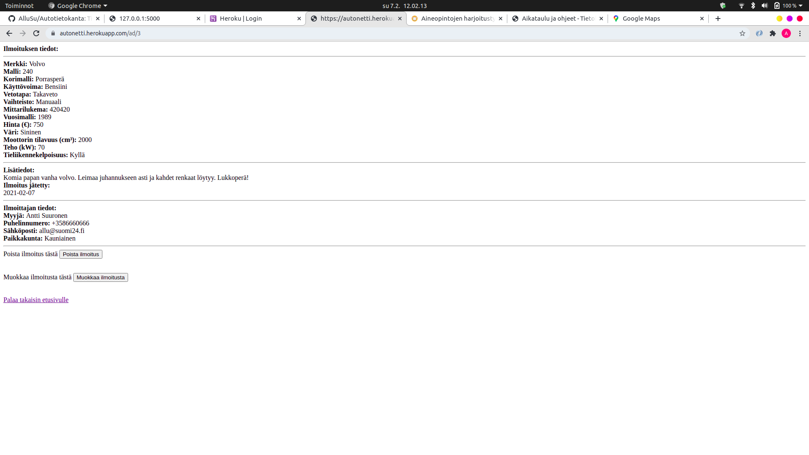
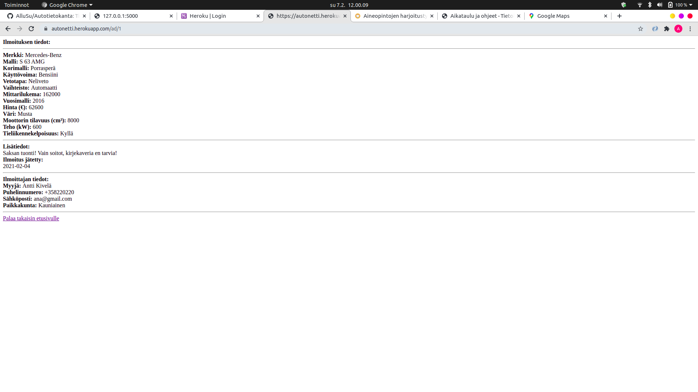
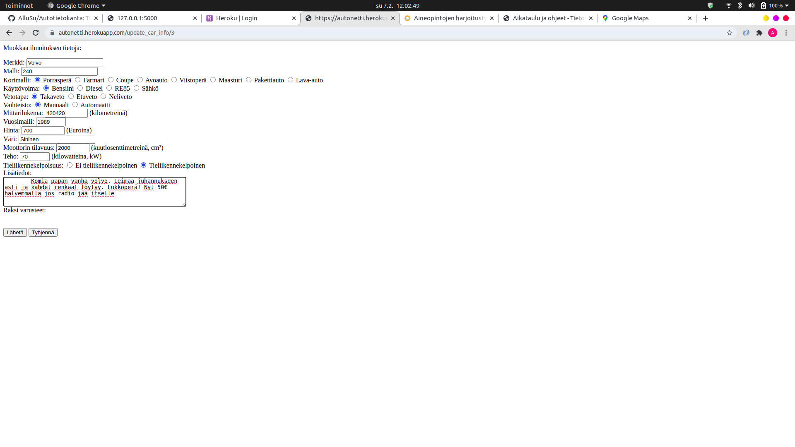
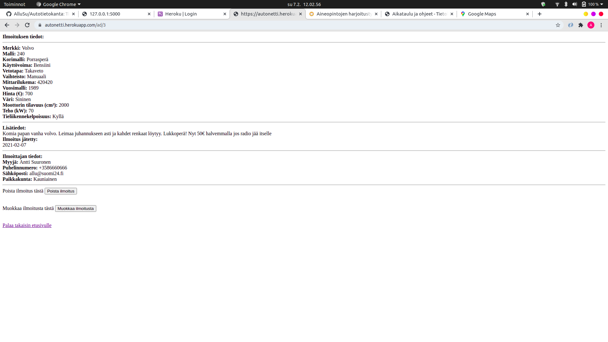
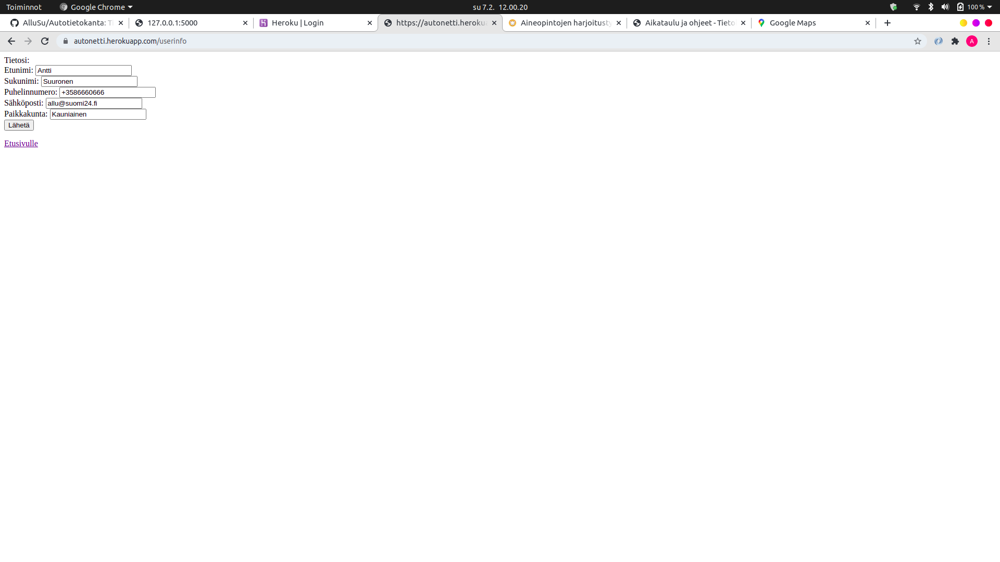

# Autotietokanta (Tietokantasovellusten harjoitustyö)  

## Vaihe 2  

Autotietokanta, tuttavallisemmin AutoNetti, on internet-sovellus, jossa eri käyttäjät voivat myydä autoja.  

### Sovelluksen käyttäminen  

#### Päänäkymä
Sovelluksen päänäkymä näyttää seuraavalta:  
  
Aktiiviset ilmoitukset eli myytävät autot näkyvät allekkain heti etusivulla ja jokaisesta on linkki tarkempiin
tietoihin. Jos käyttäjä ei ole kirjautuneena, tarjotaan mahdollisuus kirjautumiseen tai käyttäjän luontiin. 

#### Käyttäjän luominen  
Uuden käyttäjän luominen näyttää seuraavalta:  
  
Käyttäjä voi syöttää tiedot lomakkeelle jonka perusteella luodaan käyttäjä. Kaikki kentät on pakollista täyttää ja tämä on määritelty HTML-tiedostossta attribuutilla *required*.  

#### Kirjautuminen  
Tällä hetkellä sovelluksen tuotantoversiossa eli heroku-versiossa on kolme käyttäjää, joita voi testata:  
Käyttäjätunnus: allu ; Salasana: kissa123  
Käyttäjätunnus: henkka ; Salasana: koira123  
Käyttäjätunnus: ana ; Salasana: hevonen123  

Kirjautumisnäkymä näyttää seuraavalta:  
  
Jos käyttäjätunnusta ei löydy, siitä ilmoitetaan. Jos taas käyttäjätunnus löytyy, mutta annettu salasana on väärä, niin siitäkin ilmoitetaan.  

Kun käyttäjä kirjautuu sisään, näyttää etusivu seuraavalta:  
  
Kirjautuneena oleva käyttäjä voi siis:  
* Jättää uuden ilmoituksen  
* Muokata omia tietojaan  
* Kirjautua ulos
* Ja tietenkin katsella muiden ilmoituksia  

#### Ilmoituksen luonti  
Kirjautunut käyttäjä voi luoda omia ilmoituksia painamalla *Jätä ilmoitus*-painiketta, jolloin avautuu seuraavanlainen näkymä:  
  
Jälleen kaikki kentät on täytettävä, poislukien *Lisätiedot*. Lisäksi on mahdollista raksia autoon varusteita. Varusteiden talletus ei tosin ole vielä käytössä tässä versiossa. Varusteet ovat kovakoodattuja tietokantaan ja ne haetaan sieltä.  
  
Kun käyttäjä on painanut *Lähetä*, ohjaa sovellus takaisin etusivulle listaukseen.  
  

#### Ilmoitusten katselu  
Sovellus tunnistaa käyttäjän perusteella, onko tarkasteltava ilmoitus käyttäjän itsensä jättämä vai jonkun muun. Jos käyttäjän tarkastelema ilmoitus on kirjautuneena olevan käyttäjän itsensä jättämä, tarjotaan mahdollisuus ilmoituksen poistamiseen, ilmoituksen muokkaamiseen ja etusivulle siirtymiseen.  
  
Jos taas ilmoitus on jonkun muun, tarjotaan vain mahdollisuus siirtyä etusivulle:  
  

#### Ilmoituksen muokkaus
Jos käyttäjä painaa omassa ilmoituksessaan *Muokkaa ilmoitusta*, avautuu samanlainen sivu kuin jättäisi kokonaan uuden ilmoituksen (ilman varustelistausta, korjataan seuraavaan versioon). Tällä hetkellä sovellus ei osaa hakea tietokannan datan perusteella tietoa siitä, että mitkä radiobutton-komponentit ovat valittuna joten ne siirtyvät oletusarvoihinsa jokaisella muokkauskerralla, jolloin vastuu on käyttäjällä muistaa muuttaa myös ne vastaamaan alkuperäistä.  
  
Ylemmässä kuvassa on laskettu auton hintaa ja lisätty hieman tekstiä.  
  
Tällä hetkellä sovelluksessa on mystinen bugi eli jos yhdellä käyttäjällä on useampi kuin yksi ilmoitus, niin yhden ilmoituksen muokkaaminen avaa kummatkin ilmoitukset muokattavaksi. Tämä tullaan korjaamaan.  

#### Omien tietojen muokkaus  
Käyttäjän on mahdollista muokata omia käyttäjätietojaan, poislukien muuttaa salasanaa tai käyttäjätunnustaan.  
  
Painamalla *Lähetä* tiedot tallettuvat tietokantaan.
