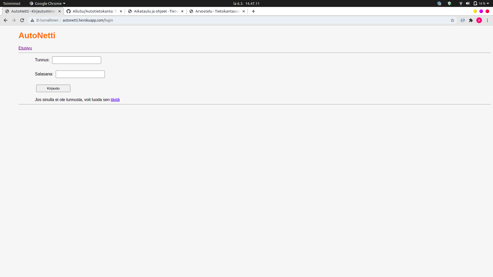
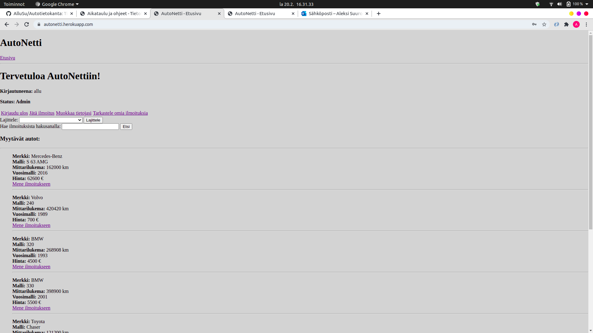
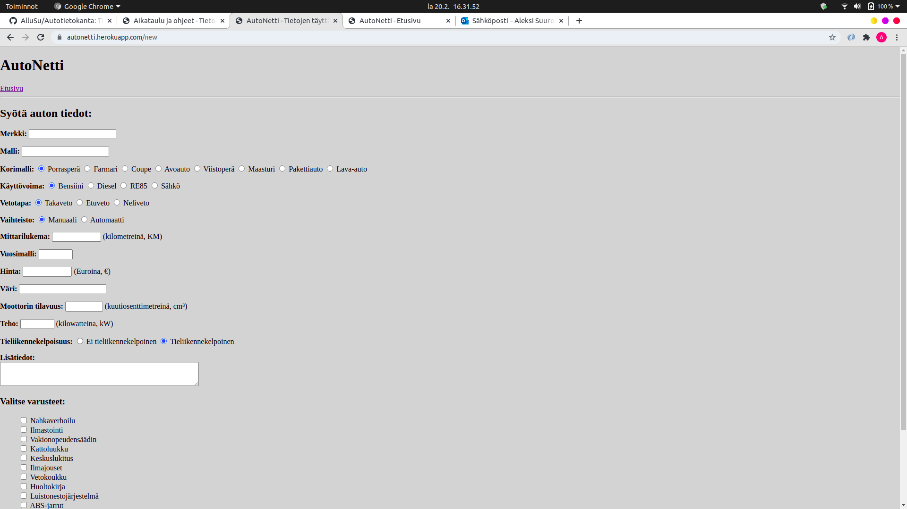
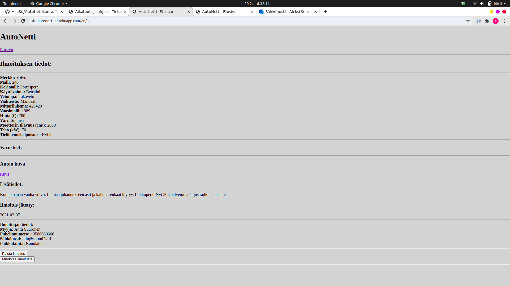
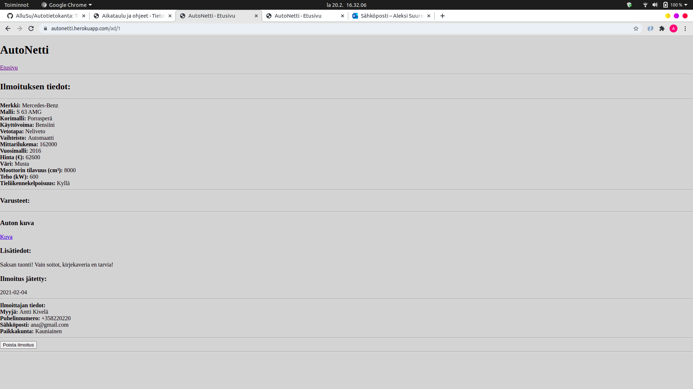
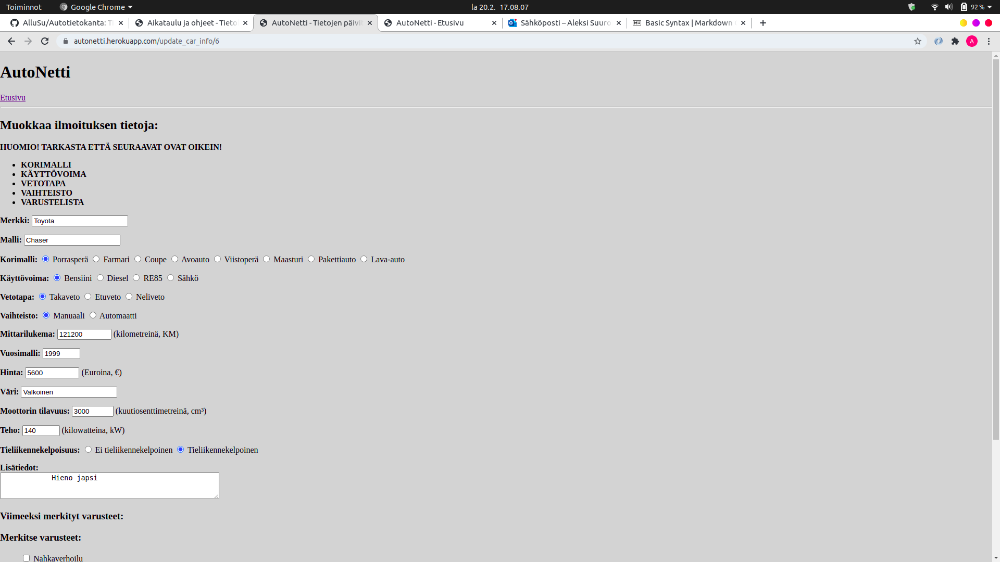
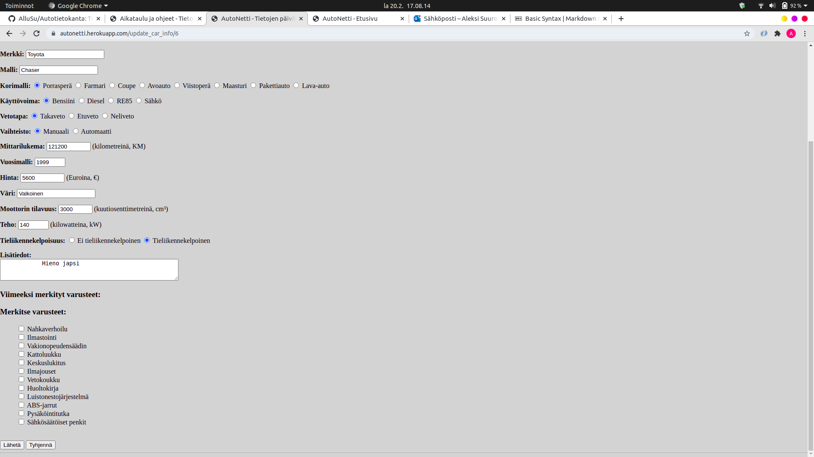
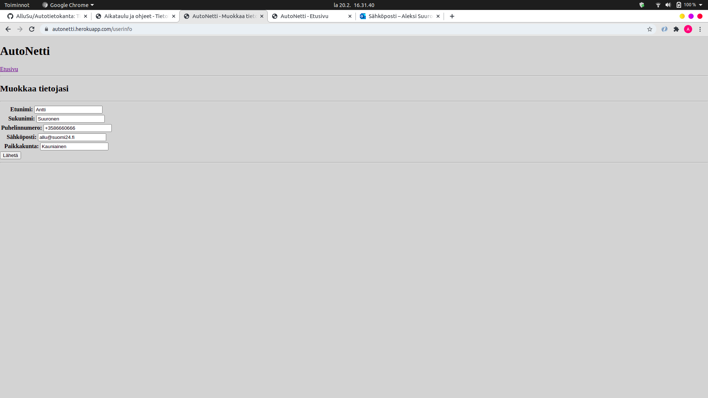

# Autotietokanta (Tietokantasovellusten harjoitustyö)  

## Vaihe 3  

Autotietokanta, tuttavallisemmin AutoNetti, on internet-sovellus, jossa eri käyttäjät voivat tehdä omista autoistaan myynti-ilmoituksia.  

https://autonetti.herokuapp.com/  

### Sovelluksen käyttäminen  

#### Päänäkymä
Sovelluksen päänäkymä näyttää seuraavalta:  
  
Aktiiviset ilmoitukset eli myytävät autot näkyvät allekkain heti etusivulla ja jokaisesta on linkki tarkempiin
tietoihin. Jos käyttäjä ei ole kirjautuneena, tarjotaan mahdollisuus kirjautumiseen tai käyttäjän luontiin. Ilmoituksia on mahdollista lajitella ja hakea hakusanalla ilmoituksista. Tällä hetkellä tosin haku-ominaisuudessa on jokin mystinen bugi ja se ei toimi aivan toivotulla tavalla. Tämä pyritään korjaamaan. 

#### Käyttäjän luominen  
Uuden käyttäjän luominen näyttää seuraavalta:  
  
Käyttäjä voi syöttää tiedot lomakkeelle jonka perusteella luodaan käyttäjä. Kaikki kentät on pakollista täyttää ja tämä on määritelty HTML-tiedostossta attribuutilla *required*. Omia tietojaan poislukien salasanaa ja käyttäjätunnusta on mahdollista muuttaa jälkeenpäin.  

#### Kirjautuminen  
Tällä hetkellä sovelluksen tuotantoversiossa eli heroku-versiossa on kolme käyttäjää, joita voi testata ja joista 1 on *Admin-käyttäjä*:  
- Käyttäjätunnus: allu
    -  Salasana: kissa123
    -  Rooli: Admin  
- Käyttäjätunnus: henkka
    - Salasana: koira123
    - Rooli: tavallinen  
- Käyttäjätunnus: ana
    - Salasana: hevonen123
    - Rooli: tavallinen  

Admin käyttäjä on kuin tavallinen käyttäjä, mutta pystyy poistamaan jokaisen ilmoituksen. Admin rooli on annettu suoraan komentorivin kautta tietokantaan.  

Kirjautumisnäkymä näyttää seuraavalta:  
  
Jos käyttäjätunnus tai salasana on väärä annetaan virheilmoitus.  

Kun käyttäjä on kirjautunut sisään, näyttää etusivu seuraavalta:  
  
Kirjautuneena oleva käyttäjä voi siis:  
* Jättää uuden ilmoituksen  
* Muokata omia tietojaan  
* Kirjautua ulos
* Katsella omia ilmoituksiaan
* Ja tietenkin katsella muiden ilmoituksia  

Jos käyttäjä on admin-käyttäjä, näkyy etusivulla status-teksti.  

#### Ilmoituksen luonti  
Kirjautunut käyttäjä voi luoda omia ilmoituksia painamalla *Jätä ilmoitus*-painiketta, jolloin avautuu seuraavanlainen näkymä:  
  
  
Jälleen kaikki kentät on täytettävä, poislukien *Lisätiedot* ja *Kuva*. Lisäksi on mahdollista raksia autoon varusteita. Varusteet ovat kovakoodattuja tietokantaan ja ne haetaan sieltä. On myös mahdollista liittää ilmoitukseen kuva, jonka maksimikoko on 100 kilotavua ja sen tiedostomuoto on *jpeg*.   
Kun käyttäjä on painanut *Lähetä*, ohjaa sovellus takaisin etusivulle listaukseen, jossa ilmoitus sitten näkyy.  

#### Ilmoitusten katselu  
Sovellus tunnistaa käyttäjän perusteella, onko tarkasteltava ilmoitus käyttäjän itsensä jättämä vai jonkun muun. Jos käyttäjän tarkastelema ilmoitus on kirjautuneena olevan käyttäjän itsensä jättämä, tarjotaan mahdollisuus ilmoituksen poistamiseen, ilmoituksen muokkaamiseen ja etusivulle siirtymiseen.  
  
Jos taas ilmoitus on jonkun muun, tarjotaan vain mahdollisuus siirtyä etusivulle:  
  
Jos taas ilmoituksen katselija on admin, tarjotaan mahdollisuus poistaa ilmoitus esimerkiksi jos siinä on aiheeton myyntiteksti tai kuva.  
  
Ilmoitukseen liitettyä kuvaa on mahdollista katsella painamalla linkkiä, jolloin se ohjaa uudelle sivulle. Tällä hetkellä kuvan näyttämisessä on pieniä ongelmia. Jokaisessa ilmoituksessa ei ole kuvaa ja jos kuvaa ei ole tulee virheilmoitus ja jos kuva on, näkyy tyhjä sivu.  

#### Ilmoituksen muokkaus
Jos käyttäjä painaa omassa ilmoituksessaan *Muokkaa ilmoitusta*, avautuu samanlainen sivu kuin jättäisi kokonaan uuden ilmoituksen. Tällä hetkellä sovellus ei osaa asettaa radiobutton-komponentteja oikeaan tilaan vaan ne menevät oletusasetuksiin, jolloin vastuu on käyttäjällä muistaa muuttaa myös ne vastaamaan alkuperäistä.  
Myöskään varuste-checkboxit eivät ole itsestään valittuna kun muokataan auton tietoja jolla on varusteita, mutta käyttäjän avuksi on laitettu informatiivinen teksti ja listaus viimeeksi valituista varusteista.  
  
  
Kuvan autossa ei ole varusteita joten lista on tyhjä.  

#### Omien tietojen muokkaus  
Käyttäjän on mahdollista muokata omia käyttäjätietojaan, poislukien muuttaa salasanaa tai käyttäjätunnustaan.  
  
Painamalla *Lähetä* tiedot tallettuvat tietokantaan ja käyttäjä ohjataan etusivulle.  