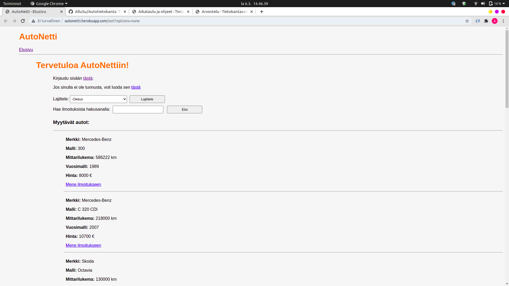
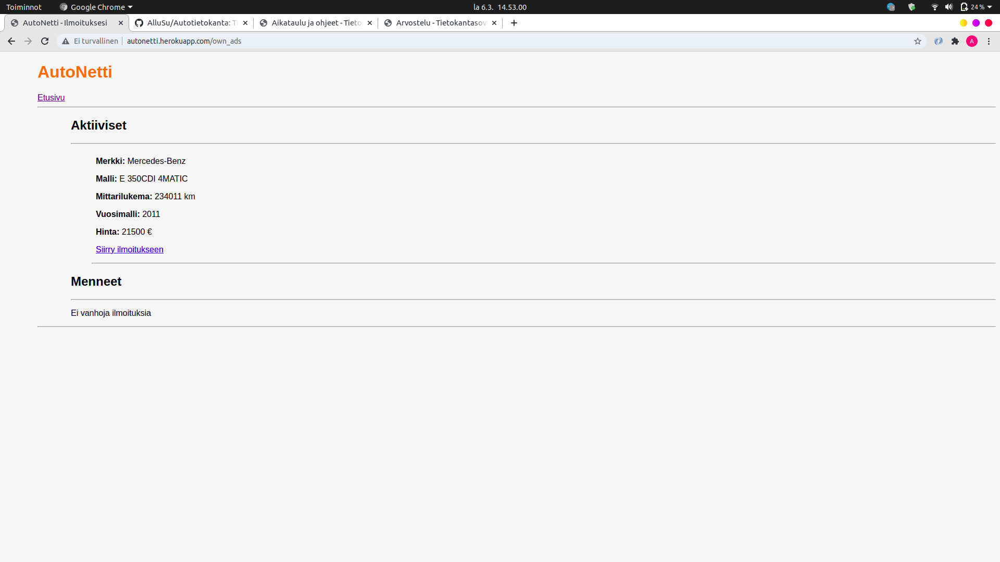
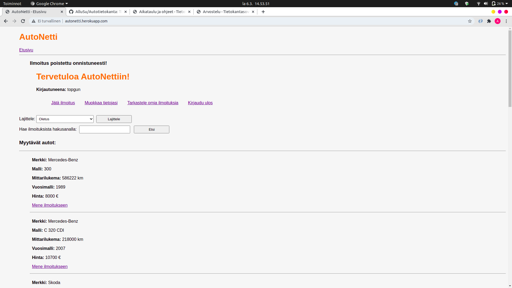

# Autotietokanta (Tietokantasovellusten harjoitustyö)  

## Loppupalautus (vaihe 4)  

Autotietokanta, tuttavallisemmin AutoNetti, on internet-sovellus, jossa kirjautuneet käyttäjät voivat tehdä omista autoistaan myynti-ilmoituksia. Sovellus löytyy osoitteesta https://autonetti.herokuapp.com/  

### Sovelluksen käyttäminen  

#### Päänäkymä
Sovelluksen päänäkymä näyttää seuraavalta:  
  
Aktiiviset ilmoitukset eli myytävät autot näkyvät allekkain heti etusivulla ja jokaisesta on linkki tarkempiin
tietoihin. Jos käyttäjä ei ole kirjautuneena, tarjotaan mahdollisuus kirjautumiseen sekä käyttäjän luontiin. Ilmoituksia on mahdollista lajitella valitsemalla lajitteluoptio valikosta ja painamalla painiketta *Lajittele*. Ilmoituksista voi myös hakea hakusanalla kirjoittamalla haluttu hakusana ja painamalla *Etsi*. Haku ei ole ns. *case sensitive* eli isot ja pienet kirjaimet ovat samanarvoisia.  
  
Ylemmässä on haettu aktiivista ilmoituksista hakusanan *jdm* sisältäviä ilmotuksia, joita on kaksi (2) kappaletta.  

#### Käyttäjän luominen  
Uuden käyttäjän luominen näyttää seuraavalta:  
  
Käyttäjä voi syöttää tiedot lomakkeelle jonka perusteella luodaan käyttäjä. Kaikki kentät on pakollista täyttää ja omia tietojaan poislukien salasanaa ja käyttäjätunnusta on mahdollista muuttaa jälkeenpäin. Puhelinnumero ja sähköposti eivät sisällä validoinnin suhteen mitään *Regex*-tarkistimia niiden monimutkaisuuden ja virhealttiuden takia. Syötteiden tarkistus tehdään niin käyttöliittymän puolella HTML-tiedostossa kuin myös palvelinpuolella ja tarvittaessa annetaan asianmukainen virheilmoitus. 
 

#### Kirjautuminen  
Kirjautumisnäkymä näyttää seuraavalta:  
  
Jos käyttäjätunnus tai salasana on väärä annetaan asianmukainen virheilmoitus.  

Kun käyttäjä on kirjautunut sisään, näyttää etusivu seuraavalta:  
  
Kirjautuneena oleva käyttäjä voi siis:  
* Jättää uuden ilmoituksen  
* Muokata omia tietojaan  
* Katsella erikseen omia ilmoituksiaan
* Kirjautua ulos
* Ja tietenkin katsella muiden ilmoituksia  

  

Jos käyttäjä on admin-käyttäjä, näkyy etusivulla status-teksti.  
  
Sovelluksessa on siis kahdenlaisia käyttäjiä, tavallisia ja *Admin*-oikeuksin varustettuja käyttäjiä. *Admin*-käyttäjä on kuin tavallinen käyttäjä, mutta se voi poistaa jokaisen ilmoituksen. Sovelluksen tuotantoversiossa eli Herokussa olevassa sovelluksessa on tällä hetkellä yksi (1) *Admin*-käyttäjä, jolle on annettu oikeudet suoraan tietokannan kautta.  

#### Ilmoituksen luonti  
Kirjautunut käyttäjä voi luoda omia ilmoituksia painamalla *Jätä ilmoitus*-painiketta, jolloin avautuu seuraavanlainen näkymä:  
  
  
Jälleen kaikki kentät on täytettävä, poislukien *Lisätiedot* ja *Kuva*. Lisäksi on mahdollista valita autoon varusteita. Varusteet ovat kovakoodattuja tietokantaan ja ne haetaan sieltä. On myös mahdollista liittää ilmoitukseen kuva, jonka maksimikoko on enintään 100 kilotavua ja tiedostomuotoa *jpeg*.   
Kun käyttäjä on painanut *Lähetä* ohjaa sovellus takaisin etusivulle listaukseen, jossa ilmoitus sitten näkyy. Syötteiden tarkistus tehdään tässäkin kahteen otteeseen eli käyttöliittymän puolella ja palvelinpuolella.  
  

#### Ilmoitusten katselu  
Sovellus tunnistaa käyttäjän perusteella, onko tarkasteltava ilmoitus käyttäjän itsensä jättämä vai jonkun muun. Jos käyttäjän tarkastelema ilmoitus on kirjautuneena olevan käyttäjän itsensä jättämä, tarjotaan mahdollisuus ilmoituksen poistamiseen, ilmoituksen muokkaamiseen ja etusivulle siirtymiseen.  
  
Jos taas ilmoitus on jonkun muun, tarjotaan vain mahdollisuus siirtyä etusivulle:  
  
  
Jos taas ilmoituksen katselija on admin, tarjotaan mahdollisuus poistaa ilmoitus esimerkiksi jos siinä on aiheeton myyntiteksti tai kuva.  
  
Ilmoitukseen liitettyä kuvaa on mahdollista katsella painamalla linkkiä, jolloin se ohjaa uudelle sivulle. Jos ilmoituksessa ei ole kuvaa, ei ole myöskään tarjolla linkkiä.

#### Ilmoituksen muokkaus
Jos käyttäjä painaa omassa ilmoituksessaan *Muokkaa ilmoitusta*, avautuu samanlainen sivu kuin jättäisi kokonaan uuden ilmoituksen. Valitettavasti tällä hetkellä sovellus ei osaa asettaa radiobutton-komponentteja oikeaan tilaan vaan ne menevät oletusasetuksiin, jolloin vastuu on käyttäjällä muistaa muuttaa myös ne vastaamaan alkuperäistä.  
Myöskään varuste-checkboxit eivät ole itsestään valittuna kun muokataan auton tietoja jolla on varusteita, mutta käyttäjän avuksi on laitettu informatiivinen teksti ja listaus viimeeksi valituista varusteista.  
  
  
Valitettavasti tällä hetkellä ilmoitukseen ei ole mahdollista lisätä jälkeenpäin kuvaa ja jos ilmoitukseen on liitetty luomisvaiheessa kuva niin ei ole mahdollista poistaa tai muokata kuvaa poistamatta vanhaa ilmoitusta ja tekemällä uutta. Lisäksi asettaessa tietokannasta tuleva data *Lisätiedot*-tekstikenttään tulee mukana useita välilyöntejä. Tämä ei ole vaarallista, vaan on vain jokin mystinen bugi.

### Ilmoituksen poisto  
Ilmoitus poistetaan painamalla painiketta *Poista ilmoitus*, jonka jälkeen käyttäjä ohjataan etusivulle.  
  
  

#### Omien tietojen muokkaus  
Käyttäjän on mahdollista muokata omia käyttäjätietojaan, poislukien muuttaa salasanaa tai käyttäjätunnustaan.  
  
Painamalla *Lähetä* tiedot tallettuvat tietokantaan ja käyttäjä ohjataan etusivulle.  
  